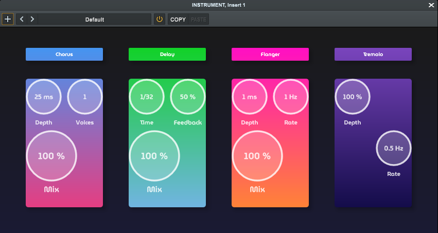

<h1>Pulp Fiction</h2>

<p align="center"></p>

<p>
    Pulp Fiction is a multi-FX rack plugin with four slots, allowing users to choose audio effects for each slot from a drop-down menu.
</p>

## Installation
### VST3 Installation (Windows)

1. **Download the Plugin:** Download Pulp.fiction.vst3 from [releases](https://github.com/enter-opy/pulp-fiction/releases).

2. **Install the Plugin:**
   - **Copy the file into your DAW's plugin directory.**
   - **Rescan Plugins:** Follow your DAW's instructions to rescan plugins or manually add the plugin if necessary.

### Build from Source
To build Pulp fiction from source:

1. **Clone the Repository:**
   ```bash
   git clone https://github.com/enter-opy/pulp-fiction.git
   cd pulp-fiction
2. **Install Dependencies:**
   - **Windows:** Make sure you have Visual Studio installed with the necessary components for C++ development.
   - **Mac:** Make sure you have Xcode installed with the command line tools.
3. **Build the Plugin:**

   **Windows:**
   - Open the project in Visual Studio.
   - Set the build configuration to `Release`.
   - Build the project by selecting `Build > Build Solution`.

   **Mac:**
   - Open the project in Xcode.
   - Set the scheme to `Release`.
   - Build the project by selecting `Product > Build`.
## Usage

- **Insert Plugin:** Load Pulp fiction into your preferred digital audio workstation (DAW).

- **Select and Adjust Effects:**
  - Each slot can be assigned one of the following effects:
    - **Chorus:**
      - **Depth (ms):** Controls the amount of delay modulation.
      - **Voices (number):** Determines the number of voices.
      - **Mix (%):** Controls the balance between the dry signal and wet signal.
    - **Delay:**
      - **Time (bars):** Determines the delay interval.
      - **Feedback (%):** Controls the amount of delay.
      - **Mix (%):** Controls the balance between the dry signal and wet signal.
    - **Flanger:**
      - **Depth (ms):** Controls the amount of delay modulation.
      - **Rate (Hz):** Controls the rate of the modulation.
      - **Mix (%):** Controls the balance between the dry signal and wet signal.
    - **Tremolo:**
      - **Depth (%):** Controls the amount of amplitude modulation.
      - **Rate (Hz):** Controls the rate of the modulation.
    - **Vibrato:**
      - **Depth (ms):** Controls the amount of pitch modulation.
      - **Rate (Hz):** Controls the rate of the modulation.

- **Customize Your Sound:** Adjust the parameters to fine-tune each effect to your preference.

## Contributing
Contributions to Pulp fiction are welcome! If you'd like to contribute, follow these steps:
1. **Fork the Repository:** Start by forking the [Pulp fiction repository](https://github.com/enter-opy/pulp-fiction).
2. **Make Changes:** Create a new branch, make your changes, and commit them to your branch.
3. **Create a Pull Request:** Push your changes to your fork and submit a pull request to the original repository.

<h2><u>References</u></h2>
<ul type="none">
    <a href="https://www.amazon.in/Audio-Effects-Theory-Implementation-Application/dp/1466560282">Reiss, J., & McPherson, A. (2014). Audio Effects: Theory, Implementation and Application.</a>
</ul>

## License
This project is licensed under the GNU General Public License. See the [LICENSE](https://github.com/enter-opy/pulp-fiction/blob/main/LICENSE) for details.

