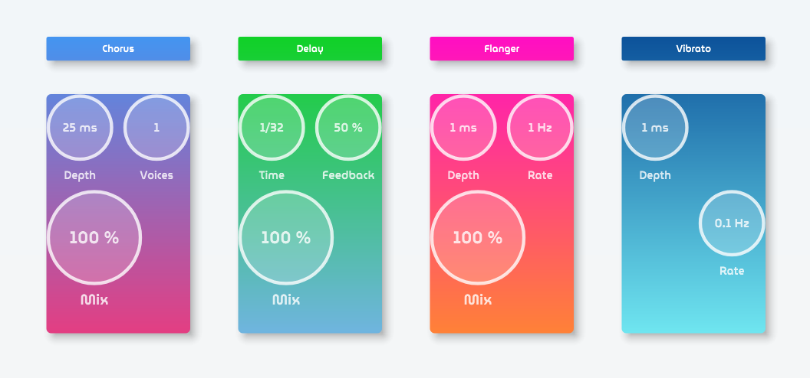

<h1>Pulp Fiction</h2>

 

    Pulp Fiction is a multi-FX rack plugin with four slots, allowing users to choose audio effects for each slot from a drop-down menu.

 
<h2><u>References</u></h2>
<ul type="none">
    Reiss, J., & McPherson, A. (2014). Audio Effects: Theory, Implementation and Application.
</ul>
